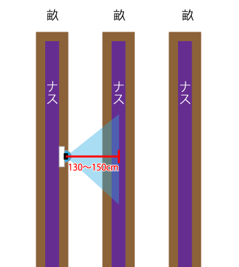

<link href="style.css" rel="stylesheet"></link>

#ナスの生育情報(花・果実数)取得システムのカメラ設置手順

## 推奨カメラスペック

<!-- 

    

 -->

* 解像度：720P〜1080P
* 視野角：90°前後
* 動作温度：-20℃〜70℃
* 防水：IP66程度
* 角度調整が可能なこと

## 設置方法
撮影したい対象物の正面に130〜150cm離してカメラ設置する。
カメラが対象物に近いと撮影範囲が狭くなる。遠すぎても対象物が小さくなり、認識精度が落ちる。

図1. 上から見たカメラ設置

レンズの角度は30°〜45°、対象物の距離に合わせて調整する。
なるべく手前の株の葉っぱがカメラにかからないようにする。

図2. 横から見たカメラ設置

撮影した画像を確認し、以下の項目が満たされていること。
* 主枝が4本以上写っていること
* 主枝の上部まで写っていること
* 株元から20cm程上から写っていること

